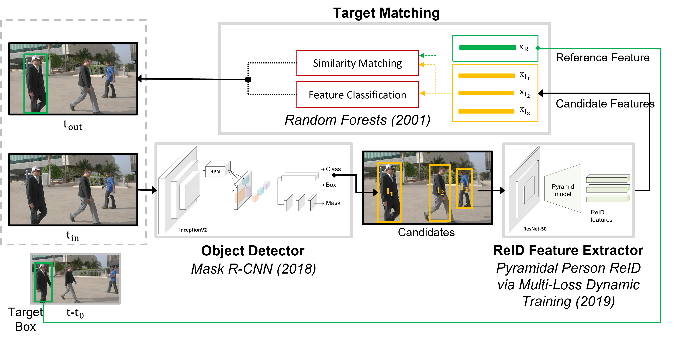

## Long-Term Person Tracking via Deep Learning [TR] 
Bachelor's thesis advised by Prof. Bilge Gunsel (February 2022)

[[Thesis]](https://001honi.github.io/static/long-term-person-tracking.pdf) [[Presentation]](https://docs.google.com/presentation/d/1EnadzqFzShOq8ujjTynSySzIdKORNUls/edit?usp=sharing&ouid=101177906929714420080&rtpof=true&sd=true) [[Demo]](https://youtu.be/a3qP-tEunqs)

Please send me an e-mail for source code.

  
<strong>SUMMARY</strong>
 
Object tracking aims to estimate the location of the target object through video
sequence where the target is initialized at the first frame. Tracking-by-detection is
a commonly used approach for object-tracking. It refers to detect all candidate target
locations via a detector-network; where the final tracked object location is determined
with data association. Deep learning based object trackers perform object detection
and data association using feature maps extracted by convolutional neural networks.
However, since the object detectors are trained for several object classes, the feature
maps extracted by them are not as discriminative as desired for a specific object
class. In order to alleviate this problem, it is common to use an additional feature
extraction network called ’re-identification’ (ReID) that enables to accurately model
the appearance changes of the target object throughout the video.
  
In this graduation project, a novel inference architecture that employs ReID features
for data association is proposed for long-term person tracking. The developed tracker
receives each video frame and feeds it into the internal object detector that outputs
candidate target locations. For each image patch corresponding to a candidate location
as well as the initial target patch, the ReID network extracts the discriminative feature
vectors. Similarity matching between the target and candidate ReID features is
achieved by cosine similarity metric where the candidate having maximum similarity
is estimated as the tracked target object. It is demonstrated that the proposed tracker
significantly improves the tracking accuracy.
  
The designed tracker architecture does not require a re-training for tracking purpose;
thus, it allows the use of any object detectors and ReID networks. The developed
inference architecture includes Mask R-CNN object detector trained on COCO dataset
to recognize 80 different objects, and a decision maker integrated with Pyramidal ReID
to extract the features of the candidate target locations. Pyramidal ReID basically is
a ResNet-50 backbone dynamically trained on Market-1501 dataset to distinguish the
person objects where dynamic training mentions to use both cross-entropy and triplet
loss functions together for optimization. However, the ReID feature extractor of the
tracker can adapt to other objects by a simple transfer-learning, if it is desired.
In the context of the graduation project, the tracker software is developed by
integrating the deep network models, trained on Tensorflow and PyTorch libraries,
into the OpenCV-Python environment. Tracking perforamance has been evaluated on
VOT-LT (Visual Object Tracking - Long Term) and LASOT (Large-scale Single Object
Tracking) datasets, which are two commonly used challenging benchmarkig data sets.
  
Long-term person tracking performance is reported on the video sequences, having
camera angle, exposure, scale, blur and luminance changes, as 79% and 61% in the
VOT-LT and LASOT databases, respectively, with at least 0.5 intersection over union
(IoU). Moreover, it is demonstrated that the proposed tracker provides comparable
performance compared to the state-of-the-art trackers.
  
<strong>REFERENCES</strong>
 
@inproceedings{zheng2019pyramidal,
  title={Pyramidal Person Re-IDentification via Multi-Loss Dynamic Training},
  author={Zheng, Feng and Deng, Cheng and Sun, Xing and Jiang, Xinyang and Guo, Xiaowei and Yu, Zongqiao and Huang, Feiyue and Ji, Rongrong},
  booktitle={Proceedings of the IEEE Conference on Computer Vision and Pattern Recognition},
  pages={8514--8522},
  year={2019}
}

@article{TDIOT,
   title={TDIOT: Target-Driven Inference for Deep Video Object Tracking},
   volume={30},
   ISSN={1941-0042},
   url={http://dx.doi.org/10.1109/TIP.2021.3112010},
   DOI={10.1109/tip.2021.3112010},
   journal={IEEE Transactions on Image Processing},
   publisher={Institute of Electrical and Electronics Engineers (IEEE)},
   author={Gurkan, Filiz and Cerkezi, Llukman and Cirakman, Ozgun and Gunsel, Bilge},
   year={2021},
   pages={7938–7951}
}

@misc{LTMU,
      title={High-Performance Long-Term Tracking with Meta-Updater}, 
      author={Kenan Dai and Yunhua Zhang and Dong Wang and Jianhua Li and Huchuan Lu and Xiaoyun Yang},
      year={2020},
      eprint={2004.00305},
      archivePrefix={arXiv},
      primaryClass={cs.CV}
}

@InProceedings{SiamRPN++,
author = {Li, Bo and Wu, Wei and Wang, Qiang and Zhang, Fangyi and Xing, Junliang and Yan, Junjie},
title = {SiamRPN++: Evolution of Siamese Visual Tracking With Very Deep Networks},
booktitle = {Proceedings of the IEEE/CVF Conference on Computer Vision and Pattern Recognition (CVPR)},
month = {June},
year = {2019}
}

@misc{mbdet,
      title={Robust Long-Term Object Tracking via Improved Discriminative Model Prediction}, 
      author={Seokeon Choi and Junhyun Lee and Yunsung Lee and Alexander Hauptmann},
      year={2020},
      eprint={2008.04722},
      archivePrefix={arXiv},
      primaryClass={cs.CV}
}

@article{RCNN,
  author    = {Ross B. Girshick and
               Jeff Donahue and
               Trevor Darrell and
               Jitendra Malik},
  title     = {Rich feature hierarchies for accurate object detection and semantic
               segmentation},
  journal   = {CoRR},
  volume    = {abs/1311.2524},
  year      = {2013},
  url       = {http://arxiv.org/abs/1311.2524},
  eprinttype = {arXiv},
  eprint    = {1311.2524},
  timestamp = {Mon, 13 Aug 2018 16:48:09 +0200},
  biburl    = {https://dblp.org/rec/journals/corr/GirshickDDM13.bib},
  bibsource = {dblp computer science bibliography, https://dblp.org}
}

@article{fastRCNN,
  author    = {Ross B. Girshick},
  title     = {Fast {R-CNN}},
  journal   = {CoRR},
  volume    = {abs/1504.08083},
  year      = {2015},
  url       = {http://arxiv.org/abs/1504.08083},
  eprinttype = {arXiv},
  eprint    = {1504.08083},
  timestamp = {Mon, 13 Aug 2018 16:49:11 +0200},
  biburl    = {https://dblp.org/rec/journals/corr/Girshick15.bib},
  bibsource = {dblp computer science bibliography, https://dblp.org}
}

@article{fasterRCNN,
  author    = {Shaoqing Ren and
               Kaiming He and
               Ross B. Girshick and
               Jian Sun},
  title     = {Faster {R-CNN:} Towards Real-Time Object Detection with Region Proposal
               Networks},
  journal   = {CoRR},
  volume    = {abs/1506.01497},
  year      = {2015},
  url       = {http://arxiv.org/abs/1506.01497},
  eprinttype = {arXiv},
  eprint    = {1506.01497},
  timestamp = {Mon, 13 Aug 2018 16:46:02 +0200},
  biburl    = {https://dblp.org/rec/journals/corr/RenHG015.bib},
  bibsource = {dblp computer science bibliography, https://dblp.org}
}

@article{maskRCNN,
  author    = {Kaiming He and
               Georgia Gkioxari and
               Piotr Doll{\'{a}}r and
               Ross B. Girshick},
  title     = {Mask {R-CNN}},
  journal   = {CoRR},
  volume    = {abs/1703.06870},
  year      = {2017},
  url       = {http://arxiv.org/abs/1703.06870},
  eprinttype = {arXiv},
  eprint    = {1703.06870},
  timestamp = {Mon, 13 Aug 2018 16:46:36 +0200},
  biburl    = {https://dblp.org/rec/journals/corr/HeGDG17.bib},
  bibsource = {dblp computer science bibliography, https://dblp.org}
}

@article{selectiveSearch,
author = {Uijlings, Jasper and Sande, K. and Gevers, T. and Smeulders, A.W.M.},
year = {2013},
month = {09},
pages = {154-171},
title = {Selective Search for Object Recognition},
volume = {104},
journal = {International Journal of Computer Vision},
doi = {10.1007/s11263-013-0620-5}
}

@article{maskFig,
author = {Cha, Young-Jin and Choi, Wooram and Suh, Gahyun and Mahmoudkhani, Sadegh and Buyukozturk, Oral},
year = {2017},
month = {11},
pages = {1-17},
title = {Autonomous Structural Visual Inspection Using Region-Based Deep Learning for Detecting Multiple Damage Types},
volume = {00},
journal = {Computer-Aided Civil and Infrastructure Engineering},
doi = {10.1111/mice.12334}
}

@misc{inception,
      title={Rethinking the Inception Architecture for Computer Vision}, 
      author={Christian Szegedy and Vincent Vanhoucke and Sergey Ioffe and Jonathon Shlens and Zbigniew Wojna},
      year={2015},
      eprint={1512.00567},
      archivePrefix={arXiv},
      primaryClass={cs.CV}
}

@misc{coco,
      title={Microsoft COCO: Common Objects in Context}, 
      author={Tsung-Yi Lin and Michael Maire and Serge Belongie and Lubomir Bourdev and Ross Girshick and James Hays and Pietro Perona and Deva Ramanan and C. Lawrence Zitnick and Piotr Dollár},
      year={2015},
      eprint={1405.0312},
      archivePrefix={arXiv},
      primaryClass={cs.CV}
}

@inproceedings{market1501,
author = {Li, Shuangqun and Liu, Xinchen and Liu, Wu and Ma, Huadong and Zhang, Haitao},
year = {2016},
month = {08},
pages = {},
title = {A Discriminative Null Space based Deep Learning Approach for Person Re-Identification},
doi = {10.1109/CCIS.2016.7790306}
}

@article{focal,
  author    = {Tsung{-}Yi Lin and
               Priya Goyal and
               Ross B. Girshick and
               Kaiming He and
               Piotr Doll{\'{a}}r},
  title     = {Focal Loss for Dense Object Detection},
  journal   = {CoRR},
  volume    = {abs/1708.02002},
  year      = {2017},
  url       = {http://arxiv.org/abs/1708.02002},
  eprinttype = {arXiv},
  eprint    = {1708.02002},
  timestamp = {Mon, 13 Aug 2018 16:46:12 +0200},
  biburl    = {https://dblp.org/rec/journals/corr/abs-1708-02002.bib},
  bibsource = {dblp computer science bibliography, https://dblp.org}
}

@article{resnet,
  author    = {Kaiming He and
               Xiangyu Zhang and
               Shaoqing Ren and
               Jian Sun},
  title     = {Deep Residual Learning for Image Recognition},
  journal   = {CoRR},
  volume    = {abs/1512.03385},
  year      = {2015},
  url       = {http://arxiv.org/abs/1512.03385},
  eprinttype = {arXiv},
  eprint    = {1512.03385},
  timestamp = {Wed, 17 Apr 2019 17:23:45 +0200},
  biburl    = {https://dblp.org/rec/journals/corr/HeZRS15.bib},
  bibsource = {dblp computer science bibliography, https://dblp.org}
}

@article {VOT,
    author = {Matej Kristan and Jiri Matas and Ale\v{s} Leonardis and Tomas Vojir and Roman Pflugfelder and Gustavo Fernandez and Georg Nebehay and Fatih Porikli and Luka \v{C}ehovin},
    journal={IEEE Transactions on Pattern Analysis and Machine Intelligence},
    title={A Novel Performance Evaluation Methodology for Single-Target Trackers},
    year={2016}, month={Nov}, volume={38}, number={11}, pages={2137-2155},
    doi={10.1109/TPAMI.2016.2516982}, ISSN={0162-8828}
}

@misc{LASOT,
      title={LaSOT: A High-quality Large-scale Single Object Tracking Benchmark}, 
      author={Heng Fan and Hexin Bai and Liting Lin and Fan Yang and Peng Chu and Ge Deng and Sijia Yu and Harshit and Mingzhen Huang and Juehuan Liu and Yong Xu and Chunyuan Liao and Lin Yuan and Haibin Ling},
      year={2020},
      eprint={2009.03465},
      archivePrefix={arXiv},
      primaryClass={cs.CV}
}

@article{breiman2001random,
  abstract = {Random forests are a combination of tree predictors such that each tree depends on the values of a random vector sampled independently and with the same distribution for all trees in the forest. The generalization error for forests converges a.s. to a limit as the number of trees in the forest becomes large. The generalization error of a forest of tree classifiers depends on the strength of the individual trees in the forest and the correlation between them. Using a random selection of features to split each node yields error rates that compare favorably to },
  added-at = {2015-04-15T08:57:31.000+0200},
  author = {Breiman, Leo},
  biburl = {https://www.bibsonomy.org/bibtex/2b8187107bf870043f2f93669958858f1/kdepublication},
  description = {Random Forests - Springer},
  doi = {10.1023/A:1010933404324},
  interhash = {4450d2e56555e7cb8f3817578e1dd4da},
  intrahash = {b8187107bf870043f2f93669958858f1},
  issn = {0885-6125},
  journal = {Machine Learning},
  keywords = {classification classifier dblp decision ensemble final forest forests imported kde learning machine ml mykopie origin random text-detection the_youtube_social_network thema:exploiting_place_features_in_link_prediction_on_location-based_social_networks trees uw_ss14_web2.0},
  language = {English},
  number = 1,
  pages = {5-32},
  publisher = {Kluwer Academic Publishers},
  timestamp = {2015-04-24T14:37:24.000+0200},
  title = {Random Forests},
  url = {http://dx.doi.org/10.1023/A%3A1010933404324},
  volume = 45,
  year = 2001
}
